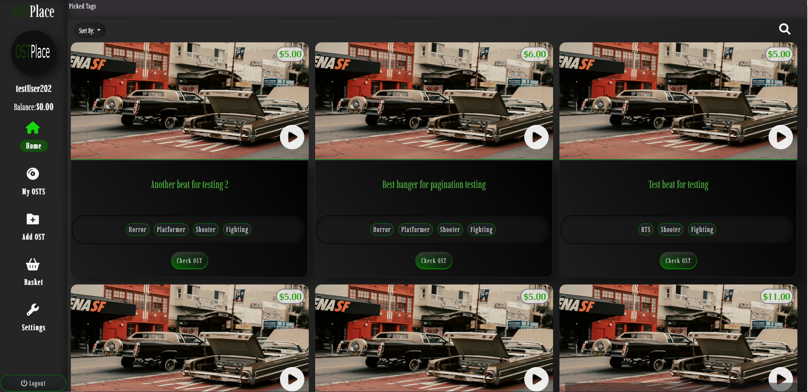

# Ostplace

## Development server
Run `npm i` to recover node_modules then run `ng serve` for a dev server, at the end navigate to `http://localhost:4200/` in your browser.

# PROJECT OVERVIEW FROM CREATOR:
Firstly User will se unlogged page, where he can listen to exemplary 3 OSTS or navigate to login component.

### At login component user can log into if he got active account

### or create new account with email confirmation.

### After that user can login correctly into site for logged users.

### On OST place user can add his song for real money.

### Modify his added content in MyOsts component

