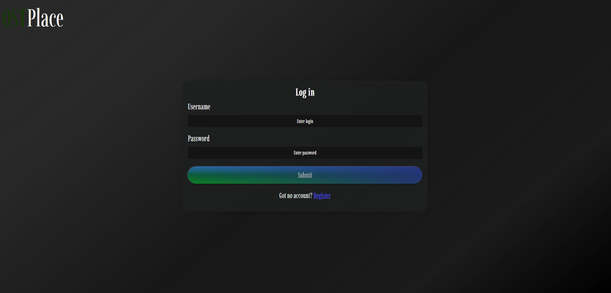
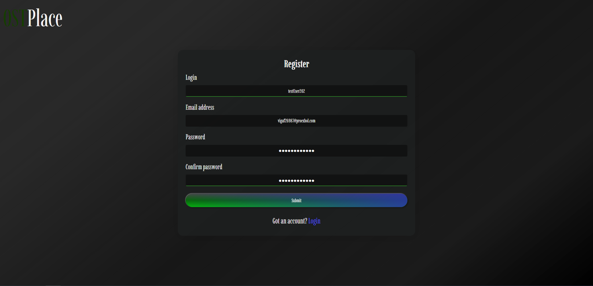
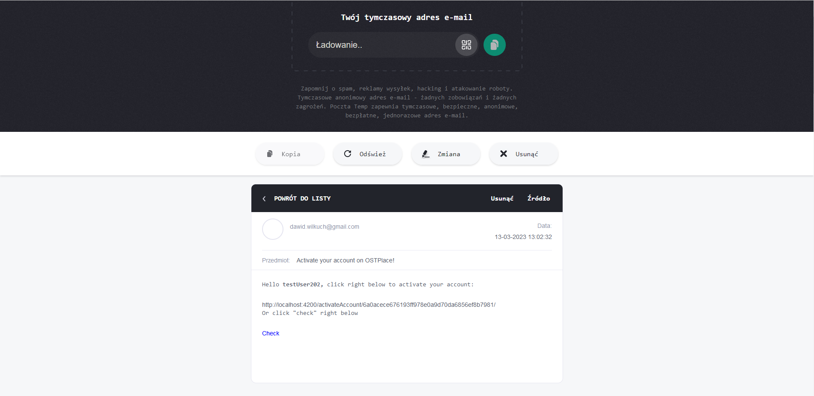
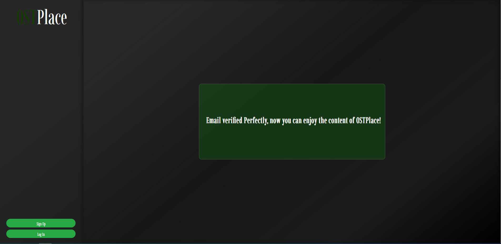
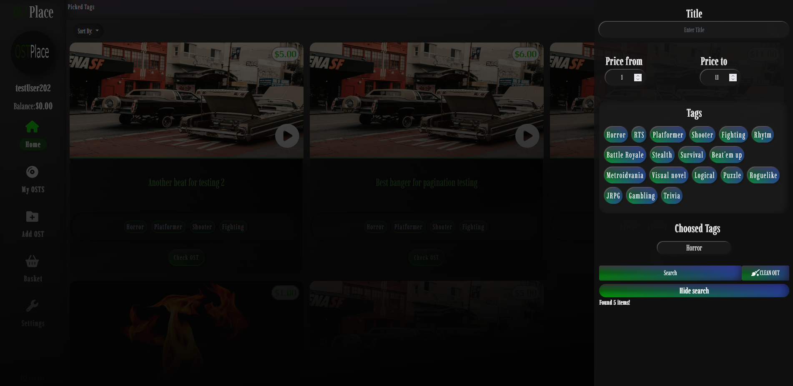
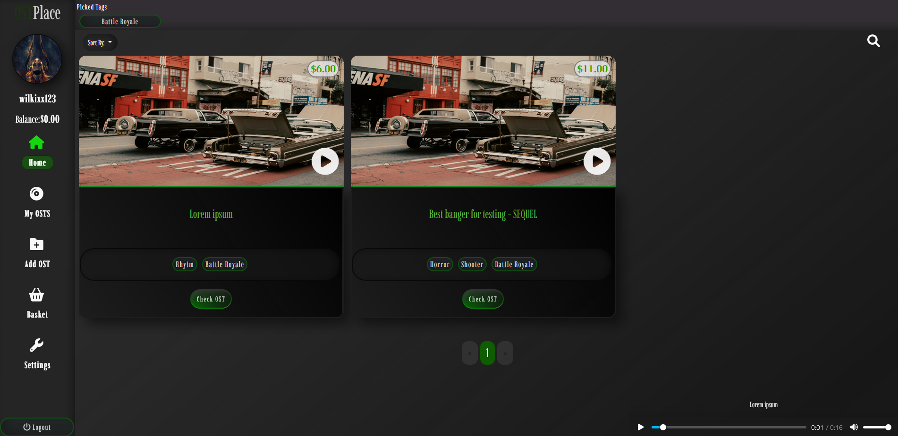
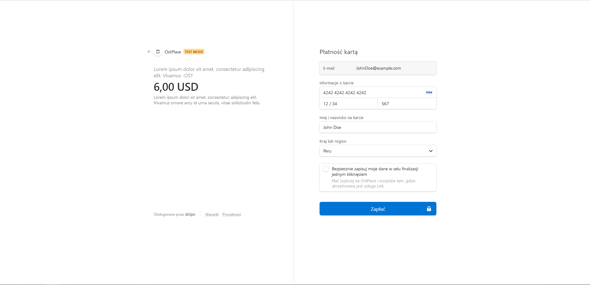
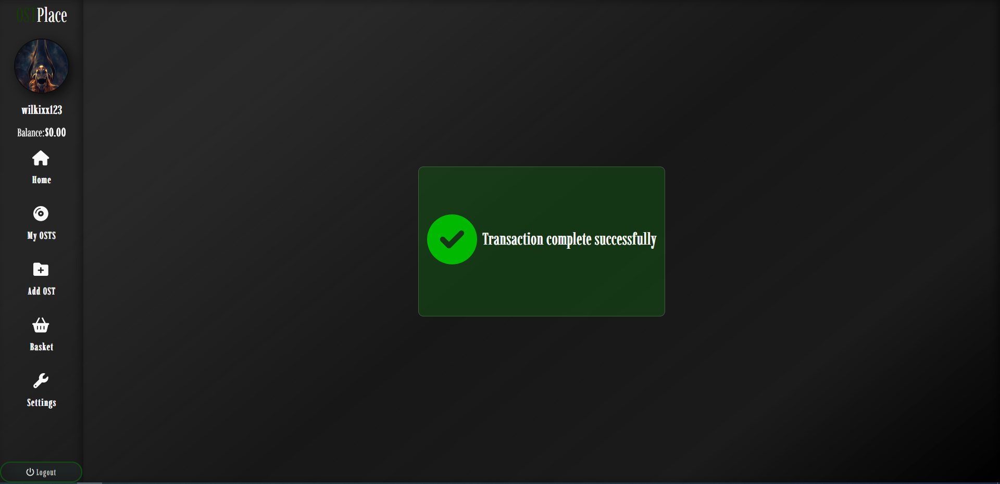

# Ostplace
### Ostplace is an angular at frontend and django backend project, created for people who cant create music, but need OSTS for their projects. 
Run `npm i` to recover node_modules then run `ng serve` for a dev server, at the end navigate to `http://localhost:4200/` in your browser.

# PROJECT OVERVIEW FROM CREATOR:
Firstly User will see unlogged page, where he can click on image and listen to exemplary 3 OSTS or navigate to login component.

### At login component user can log into, if he got active account.

### If not, he can create new account with email confirmation.

### After that user can login correctly into site for logged users.

## User can sort by search Tab and by simple click on tag in OST.
#SearchTAB

## Both versions of search result can be sorted

#Tag click

### On OST place user can add his song for real money.

### Modify his added content in MyOsts component

### Change his user account.

### And ofcourse buy OSTS. On example image below user "wilkixx123" has been added a song, so "testUser202" might be able to buy it by clicking "check OST" and "add to basket" button.

### in basket user will see added items that he is going to buy or remove from basket.

### If user decide to buy items from basket he will be moved to payment gateway where he can insert credit card informations. To show how it works firstly i'm going to log into "stripe" from CMD to get access.

### Now i can listen to stripe payment

### when user will provide credit card details where he got enough balance, he will got basket removed and bought items will be added into his account. Meanwhile person who sold it will get money minus my and stripe percents.

### card details insert.

### payment status
user

stripe

### After payment basket
customer basket

seller basket

## stripe customer balance after he sold item

# And thats how it works at the moment.
